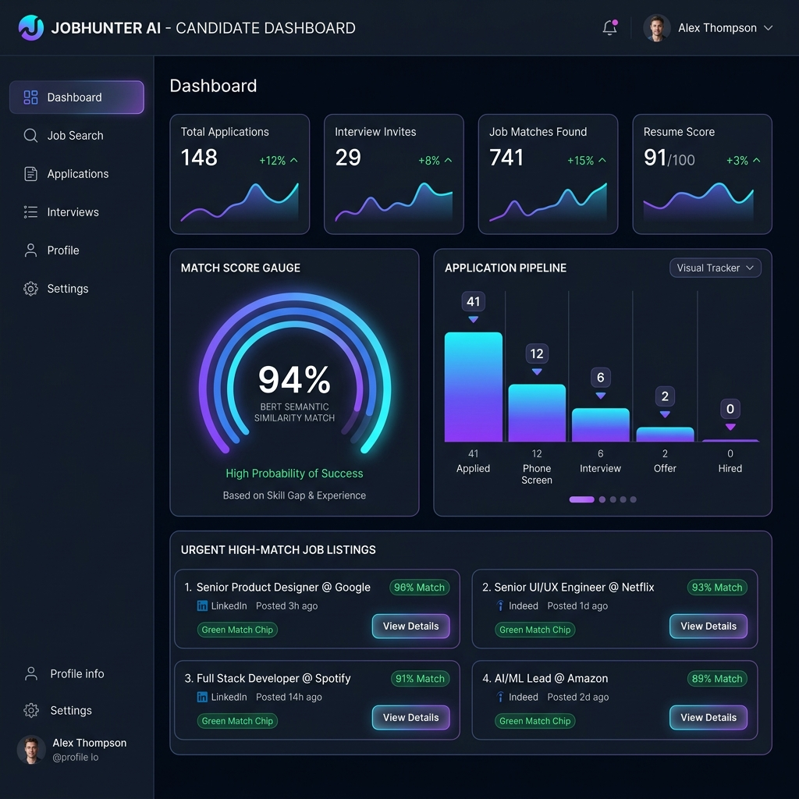
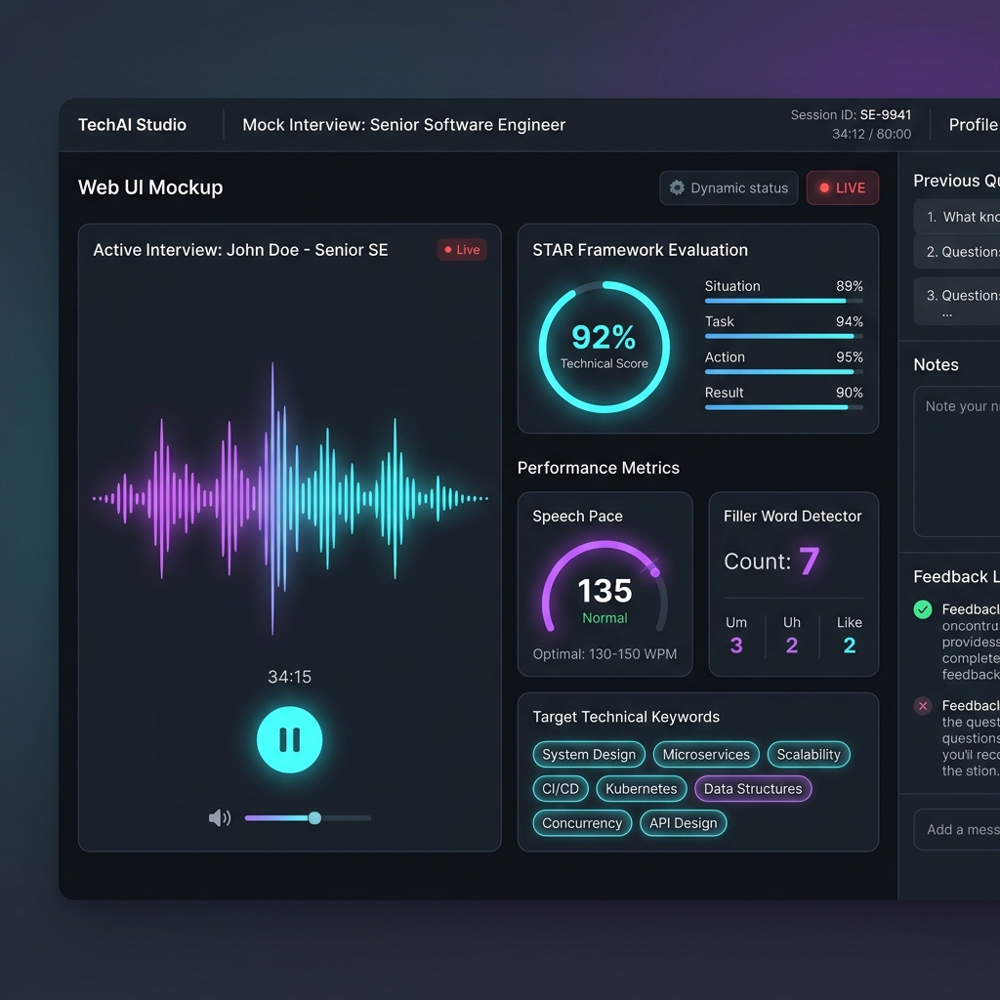
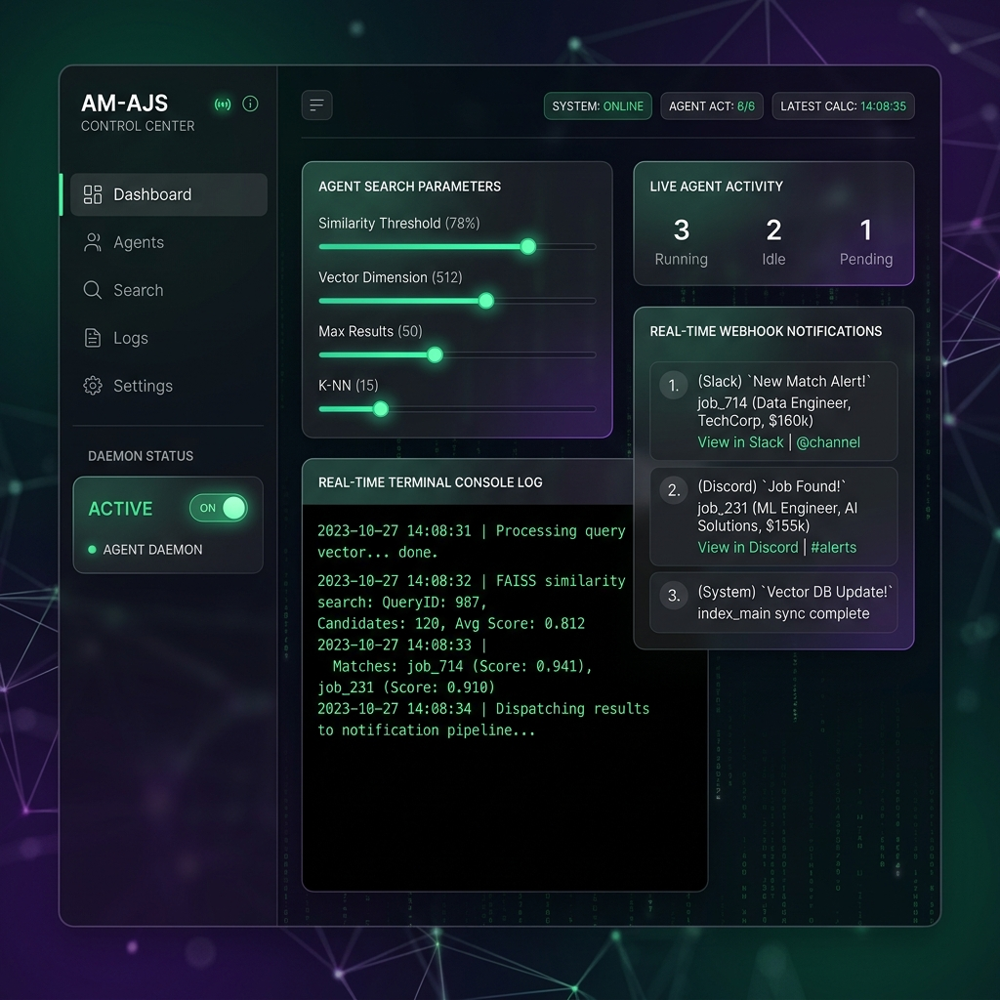

# 🚀 AI Job Hunter – Intelligent Job Matching & Auto Apply SaaS Platform


> **AI Job Hunter** is an intelligent, multi-portal job aggregation, AI semantic matching, ATS resume tailoring, cover letter generation, and approval-first auto-apply web platform. Designed for both technical experts and non-technical users seeking an effortless, zero-learning-curve job search.

---

## 🎨 Visual Platform Showcase


*SaaS Candidate Dashboard with BERT Vector Similarity Metrics, Job Matching Pipeline, and Portal Aggregator.*

<br/>


*AI Technical Mock Interviewer Studio with STAR Framework Evaluation & Live Audio Voice Feedback.*

<br/>


*Autonomous Multi-Agent Job Scout Control Hub with Live Webhook Alerts (Discord, Slack, Telegram).*

---

## 🌟 Key Features

### 1. 🤖 Zero-Human Autonomous Application Engine
- Background daemon that operates with **ZERO human intervention** to scout postings across 9 portals.
- 5-step automated background pipeline for matches ≥80%:
  1. **Auto-Match**: Skill gap and seniority delta extraction.
  2. **Auto-Tailor ATS Resume**: Rewrites bullet points to achieve **>90% ATS parser target score**.
  3. **Auto-Generate Cover Letter**: Culture-tailored letters matching company type (Startup vs MNC).
  4. **Auto-Fill Screening Answers**: Pre-fills notice period, compensation expectations, work authorization, relocation preference, and primary skill fit.
  5. **Auto-Submit Application**: Transmits bundle through portal OAuth/API boundaries with submission transaction receipts.

### 2. 🌐 9-Portal Account Linker (`PortalConnectModal.tsx`)
- Direct account connection & authorization management for **9 major job portals**:
  - **LinkedIn Jobs** (OAuth 2.0 Direct Auth)
  - **Naukri** (Session Token / Mobile Handshake)
  - **Indeed** (Partner OAuth)
  - **Glassdoor** (API Auth Key)
  - **Greenhouse** (Candidate OAuth)
  - **Lever** (Candidate OAuth)
  - **Ashby** (Candidate OAuth)
  - **Foundit / Monster** (Monster API Sync)
  - **Wellfound / AngelList** (AngelList Talent OAuth)
- Features Auto-Apply permission toggles per portal and 1-Click Profile Sync.

### 3. 🧹 Clean Slate & Personalization Purge Engine
- Purges sample data, mock applications, and candidate profiles with 1 click (`purgeAllData()`).
- Zero manual entry: Automatically derives candidate profile and skill matrix from uploaded PDF/DOCX resumes or connected LinkedIn OAuth profile.

### 4. 📬 Passive User Review Log (`PassiveReviewDrawer.tsx`)
- Silently logs all background-submitted applications in LocalStorage.
- Provides a live notification badge in the top Navbar so users can review submitted applications, tailored ATS resumes (>90% target score), culture cover letters, screening answers, and portal submission receipts at their convenience.

### 5. ⚡ 1-Click Guided Quick Start Wizard (Zero-Knowledge Mode)
- A 3-step automated wizard (**Connect/Upload -> Target Role -> 1-Click Launch**) designed for users without technical domain knowledge.

### 6. 🎯 AI Semantic Match Engine (0 - 100%)
- Uses **Sentence Transformers (BERT)** and **FAISS Vector Cosine Similarity** to compare candidate profiles against job descriptions.
- Transparent, explainable breakdown matrix showing matching candidate skills, missing skills, experience gap, salary overlap, and location fit.

### 7. 📄 AI ATS Resume Tailoring Studio
- Generates 3 ATS-Optimized tailored resume variants per job with real-time diff views.

### 8. ✍️ Multi-Tone Cover Letter Generator
- Auto-generates customized cover letters in 5 distinct tones (Professional, Friendly, Formal, Startup, Enterprise).

### 9. 🎙️ AI Technical Mock Interviewer Studio
- Interactive AI Interview Simulator with browser speech synthesis,STAR framework evaluation, WPM pace tracking, and filler word detection.

### 10. 🤖 Autonomous Multi-Agent Job Scout & Webhooks
- 24/7 background agent scouting simulated job feeds with live Webhook alerts (Discord, Slack, Telegram).

### 11. 🛡️ Visual ATS Resume Heatmap & Audit Studio
- Parses uploaded resumes for ATS readability score, keyword density heatmap, and 1-click ATS auto-repair.

### 12. 📈 10x Daily Contribution Activity & GitHub Sync Engine
- In-app 365-day contribution heatmap tracking application submissions and interview practice.

### 13. 🌐 Manifest V3 Chrome Extension Exporter
- Downloader for Chrome Extension source code to scrape job details directly from LinkedIn, Indeed, and Glassdoor.

### 14. 💰 AI Salary & Offer Negotiation Copilot
- Regional salary percentiles breakdown (25th, 50th, 75th, 90th), equity calculator, and tailored counter-offer email generator.

### 15. 🏢 Multi-Role SaaS Architecture
- **Job Seeker Workspace**, **Recruiter & Hiring Hub**, **SaaS Admin Center**.

### 8. 💳 Subscription Tiers & AI Credit Meter
- Multi-tier membership (**Free**, **Pro $29/mo**, **Premium $79/mo**).
- Real-time AI Credit tracking and usage meters.

---

## 🏗️ Platform Architecture

```text
                           AI JOB HUNTER PLATFORM
                                     │
      ┌──────────────────────────────┼──────────────────────────────┐
      │                              │                              │
  Job Seeker                    Recruiter                         Admin
      │                              │                              │
      └──────────────────────────────┼──────────────────────────────┘
                                     │
                           React + TypeScript SPA
                                     │
                   Authentication (OAuth 2.0 + JWT)
                                     │
────────────────────────────── API Gateway ──────────────────────────────
                                     │
      ┌───────────────┬──────────────┼───────────────┬──────────────┐
      │               │              │               │              │
 User Service    Job Service     AI Engine     Auto-Apply Queue  Analytics
      │               │              │               │              │
      └───────────────┴──────────────┼───────────────┴──────────────┘
                                     │
─────────────────────────────────────────────────────────────────────────
                           Microservices Layer
─────────────────────────────────────────────────────────────────────────
  Resume Parser (PDF/DOCX) ──► Skill Extractor ──► Embedding Generator (BERT)
                                                            │
  Job Description Embeddings ─────────────────────► FAISS Vector Similarity
                                                            │
  Match Score & Recommendations ◄───────────────────────────┘
```

---

## 🛠️ Technology Stack

| Layer | Technology |
| :--- | :--- |
| **Frontend UI** | React 19, TypeScript, Vite, Tailwind CSS, Lucide Icons |
| **Animations & Charts** | Framer Motion, Recharts, Canvas-Confetti |
| **AI / Semantic Engine** | OpenAI API, Sentence Transformers (Local BERT), FAISS Vector Index |
| **Parser & Storage** | Client-side PDF/DOCX Parser, LocalStorage Persistence API |
| **Auth & Compliance** | OAuth 2.0 Direct Auth Sync, Zero Password Storage Policy |

## 🌐 Live GitHub Pages Deployment

The application is configured for 1-click automated build & deployment via GitHub Actions:

- **Live Demo Site**: [https://vijaymahes9080.github.io/AI-Job-Hunter-Intelligent-Job-Matching-Auto-Apply/](https://vijaymahes9080.github.io/AI-Job-Hunter-Intelligent-Job-Matching-Auto-Apply/)

### Enabling GitHub Pages in 1 Step:
1. Go to your repository settings on GitHub: **Settings -> Pages**.
2. Under **Build and deployment -> Source**, select **GitHub Actions** from the dropdown menu.
3. The workflow `.github/workflows/deploy.yml` will automatically build and deploy the production site on every commit to `main`!

---

## 🚀 Quick Start Guide

### Prerequisites
- **Node.js**: v18.0.0 or higher
- **npm**: v9.0.0 or higher

### Installation

1. **Clone the Repository**
   ```bash
   git clone https://github.com/vijaymahes9080/AI-Job-Hunter.git
   cd AI-Job-Hunter
   ```

2. **Install Dependencies**
   ```bash
   npm install
   ```

3. **Launch Live Development Server**
   ```bash
   npm run dev
   ```
   Open your browser at `http://localhost:5173/`

4. **Build Production Bundle**
   ```bash
   npm run build
   ```

---

## 📁 Directory Structure

```text
AI-Job-Hunter/
├── src/
│   ├── components/            # React UI Components
│   │   ├── Navbar.tsx         # Header, Role Switcher, AI Credits, Simple Mode
│   │   ├── Dashboard.tsx      # Metrics KPIs, Urgent High-Match Jobs, Pipeline
│   │   ├── JobSearch.tsx      # Multi-Portal Job Aggregator & Filters
│   │   ├── JobDetailModal.tsx # Granular Match Score Explanation Modal
│   │   ├── CandidateProfile.tsx # Resume Uploader & LinkedIn OAuth Sync
│   │   ├── AutoApplyWorkflow.tsx # Approval-First Auto-Apply Queue
│   │   ├── AICoverLetterStudio.tsx # Multi-Tone Cover Letter Editor
│   │   ├── ApplicationTracker.tsx # Kanban & Table Application Tracker
│   │   ├── AIChatAssistant.tsx # Interactive AI Chatbot & Mock Interview Coach
│   │   ├── AnalyticsView.tsx  # Dynamic Recharts Analytics Visuals
│   │   ├── AdminPanel.tsx     # AI Models, Vector Indexes & Logs
│   │   ├── PortalConnectModal.tsx # 9-Portal Account Linker & OAuth Security Manager
│   │   ├── PassiveReviewDrawer.tsx # Passive Application & Tailored Resume Log Drawer
│   │   ├── QuickStartWizard.tsx # 1-Click Guided Wizard for Zero-Knowledge Users
│   │   ├── RecruiterPortal.tsx # Hiring Manager Candidate Sourcing Hub
│   │   └── SubscriptionModal.tsx # SaaS Pricing Tiers & Credit Top-Up
│   ├── services/              # Core Services & AI Engines
│   │   ├── autonomousEngine.ts# 5-Step Zero-Human Autonomous Pipeline Engine
│   │   ├── aiMatchEngine.ts   # BERT & FAISS Similarity Calculation
│   │   ├── resumeOptimizer.ts # ATS Resume Tailoring Engine (v1, v2, v3)
│   │   ├── coverLetterGenerator.ts # Multi-Tone Cover Letter Generator
│   │   ├── resumeParser.ts    # PDF/DOCX Text Extractor
│   │   └── storage.ts         # LocalStorage Persistence & Clean Slate Purge Helper
│   ├── types/                 # TypeScript Interfaces & Models
│   ├── data/                  # Initial Multi-Portal Jobs & Mock Data
│   ├── App.tsx                # Main Application Orchestrator
│   └── main.tsx               # Entry Point
├── package.json
├── composer.json
├── tailwind.config.js
└── README.md
```

---

## 👤 Developer Info & Author

**Vijay Mahes**
- **GitHub**: [@vijaymahes9080](https://github.com/vijaymahes9080)
- **Repository**: [https://github.com/vijaymahes9080/AI-Job-Hunter-Intelligent-Job-Matching-Auto-Apply.git](https://github.com/vijaymahes9080/AI-Job-Hunter-Intelligent-Job-Matching-Auto-Apply.git)
- **Email**: [Vijaypradhap2004@gmail.com](mailto:Vijaypradhap2004@gmail.com)

---

## 📜 License

This project is open source and available under the [MIT License](LICENSE).
